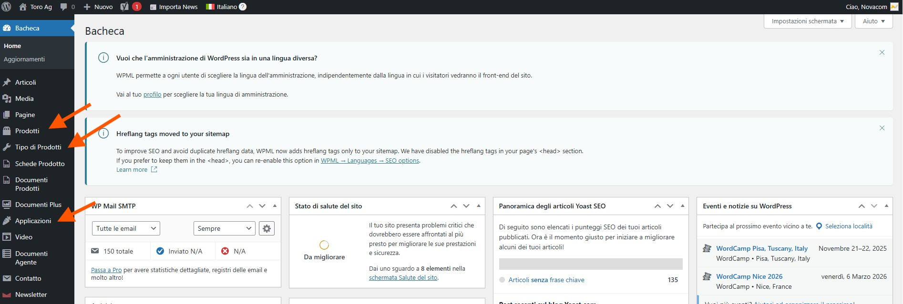

# Dashboard e Panoramica

## Accedere all'Amministrazione

Per gestire i contenuti del sito, dovrai accedere all'area di amministrazione WordPress.

1. Vai all'indirizzo: `https://www.toro-ag.it/wp-admin/`
2. Inserisci il tuo username e password
3. Clicca su "Accedi"

## La Dashboard Amministrativa

Una volta effettuato l'accesso, ti trovi nella **Dashboard** - il tuo centro di controllo.

### Menu Principale

Nel menu laterale a sinistra trovi le sezioni principali che utilizzerai:

**🎯 Sezioni Importanti per i Contenuti:**
- **[Prodotti](03-prodotti.md)** - Gestire i singoli prodotti
- **[Tipo di Prodotti](02-tipi-prodotto.md)** - Gestire le categorie di prodotti
- **[Applicazioni](04-applicazioni.md)** - Gestire le applicazioni/colture

## Interfaccia di Base

### Area di Lavoro
La parte centrale della pagina è la tua **area di lavoro** dove vedrai:
- Liste di contenuti esistenti
- Moduli per creare/modificare contenuti
- Opzioni e impostazioni

### Pulsanti Principali
- **Aggiungi nuovo** - Creare nuovi contenuti
- **Modifica** - Modificare contenuti esistenti  
- **Salva** - Salvare le modifiche
- **Pubblica** - Rendere visibili i contenuti sul sito

⚠️ **Importante**: Ricordati sempre di cliccare "Pubblica" o "Aggiorna" per rendere visibili le modifiche sul sito!

## Stati dei Contenuti

I tuoi contenuti possono avere diversi stati:

- **Pubblicato** ✅ - Visibile sul sito
- **Bozza** 📝 - Salvato ma non ancora pubblicato
- **In revisione** 👀 - In attesa di controllo

💡 **Suggerimento**: Puoi sempre salvare come "Bozza" se vuoi continuare a lavorare su un contenuto prima di pubblicarlo.

## Cosa Vedrai sul Sito

Quando pubblichi i contenuti, questi appariranno in queste sezioni del sito:

- **Tipi di Prodotto** → `https://www.toro-ag.it/prodotti/`
- **Prodotti Singoli** → `https://www.toro-ag.it/prodotti/[tipo]/[prodotto]/`
- **Applicazioni** → `https://www.toro-ag.it/applicazioni/`

✅ **Risultato**: Dopo ogni modifica, controlla sempre come appare sul sito per assicurarti che sia tutto a posto.

---

**Prossimo**: [Gestire i Tipi di Prodotto →](02-tipi-prodotto.md)