# Gestire i Tipi di Prodotto

I **Tipi di Prodotto** rappresentano una tassonomia custom che organizza i tuoi prodotti in termini specifici (es. "Manichetta e Ala Gocciolante", "Tempus® Air Programmatori", "Gocciolatori"). Nel frontend, questa tassonomia viene visualizzata come **"Prodotti"**.

## Dove si Vedono i Tipi di Prodotto

**Sul sito pubblico:**
- Pagina archivio: <a href="https://www.toro-ag.it/prodotti/" target="_blank">https://www.toro-ag.it/prodotti/</a>
- Singola categoria: <a href="https://www.toro-ag.it/prodotti/manichetta-e-ala-gocciolante/" target="_blank">https://www.toro-ag.it/prodotti/manichetta-e-ala-gocciolante/</a>

**Nell'amministrazione:**

**Passo 1: Accedere alla tassonomia**

Clicca su **"Tipo di Prodotti"** nella barra laterale.

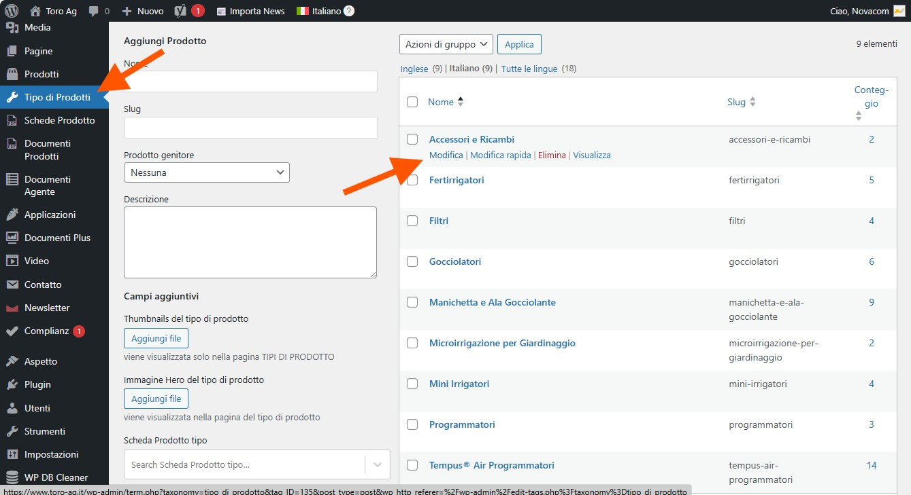

**Passo 2: Modificare un termine**

Clicca su **"Modifica"** sotto il nome del termine che vuoi modificare.

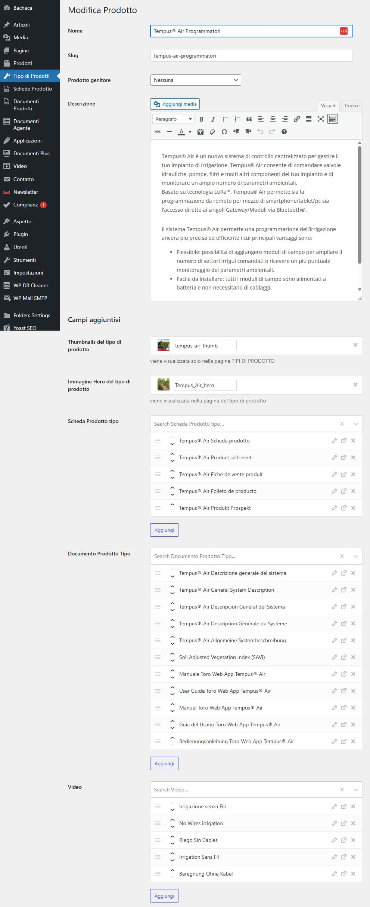

---

## Come i Campi Custom Appaiono sul Sito

Di seguito la corrispondenza tra gli elementi visualizzati nel frontend e i singoli campi da compilare nel backend.

### Titolo

**Nel frontend:**

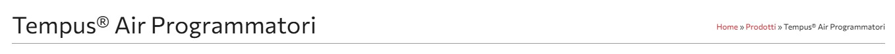

**Nel backend:**

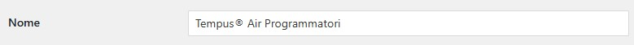

Modifica il campo **"Nome"** (funzionamento standard WordPress).

---

### Descrizione

**Nel frontend:**

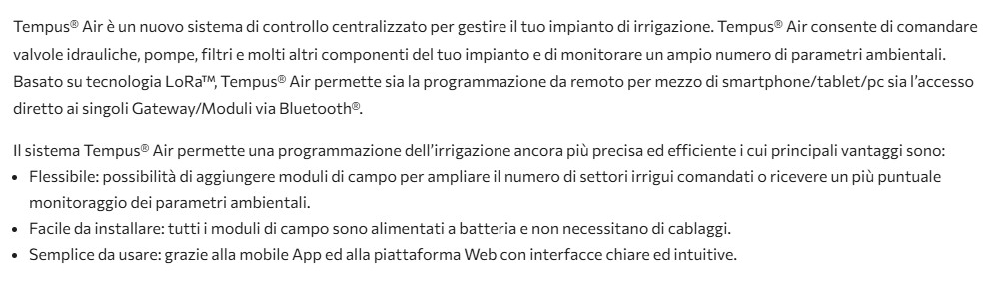

**Nel backend:**

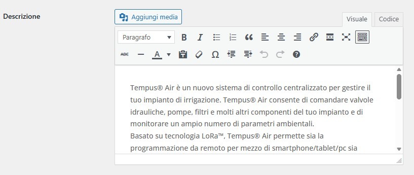

Usa l'editor **"Descrizione"** con formattazione Rich Text.

---

### Thumbnail (Miniatura)

**Nel frontend:**

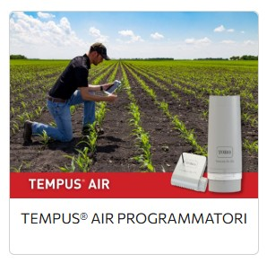

**Nel backend:**

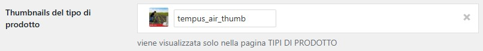

Clicca **"Aggiungi file"** nel campo **"Thumbnails del tipo di prodotto"**. Dimensione consigliata: 400x300px.

---

### Immagine Hero

**Nel frontend:**

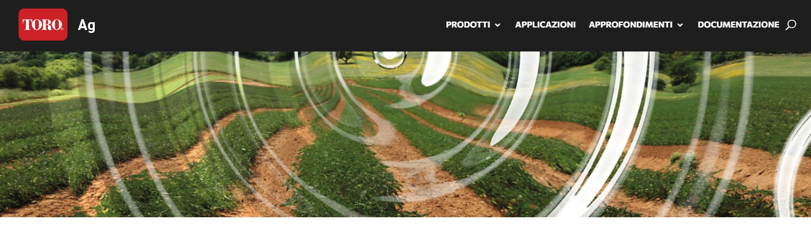

**Nel backend:**

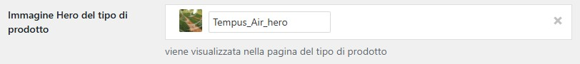

Clicca **"Aggiungi file"** nel campo **"Immagine Hero del tipo di prodotto"**. Dimensione consigliata: 1920x600px.

---

### Schede Prodotto

**Nel frontend:**

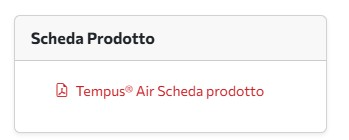

**Nel backend:**

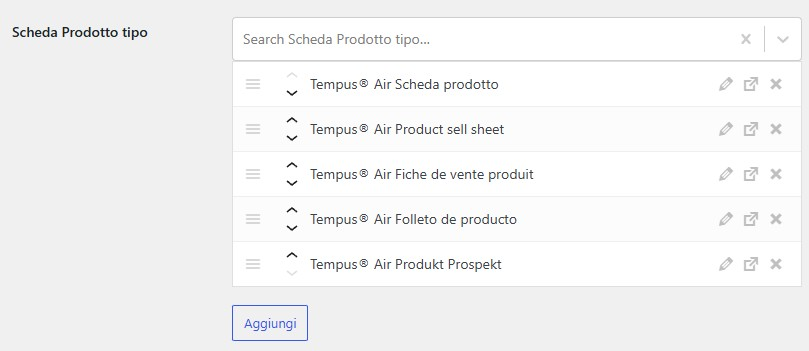

Seleziona le schede dal campo **"Scheda Prodotto tipo"**.

💡 Per gestire i file delle schede, vedi [Allegati Multilingua](05-allegati-multilingua.md).

---

### Documenti

**Nel frontend:**

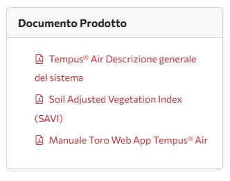

**Nel backend:**

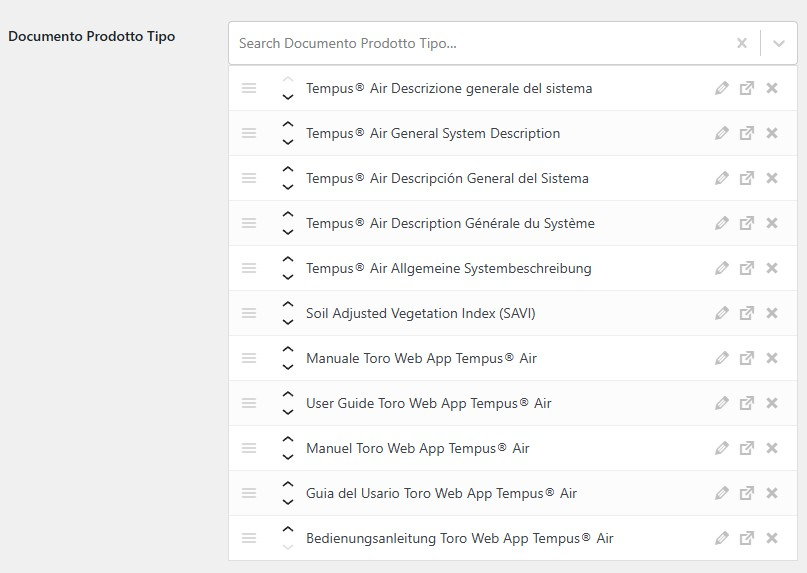

Seleziona i documenti dal campo **"Documento Prodotto Tipo"**.

💡 Per gestire i file dei documenti, vedi [Allegati Multilingua](05-allegati-multilingua.md).

---

### Video

**Nel frontend:**

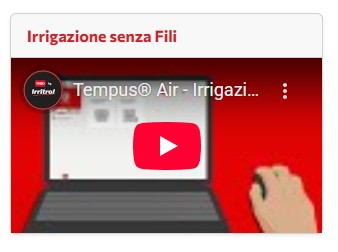

**Nel backend:**

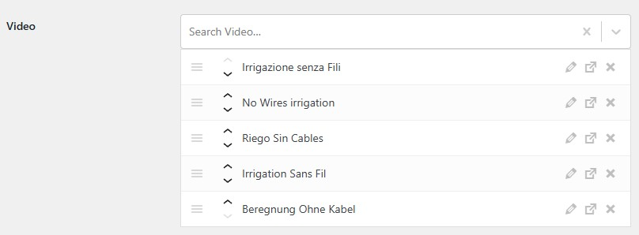

Seleziona i video dal campo **"Video"**.

💡 Per gestire i video, vedi [Allegati Multilingua](05-allegati-multilingua.md).

---

### Prodotti Associati

**Nel frontend:**

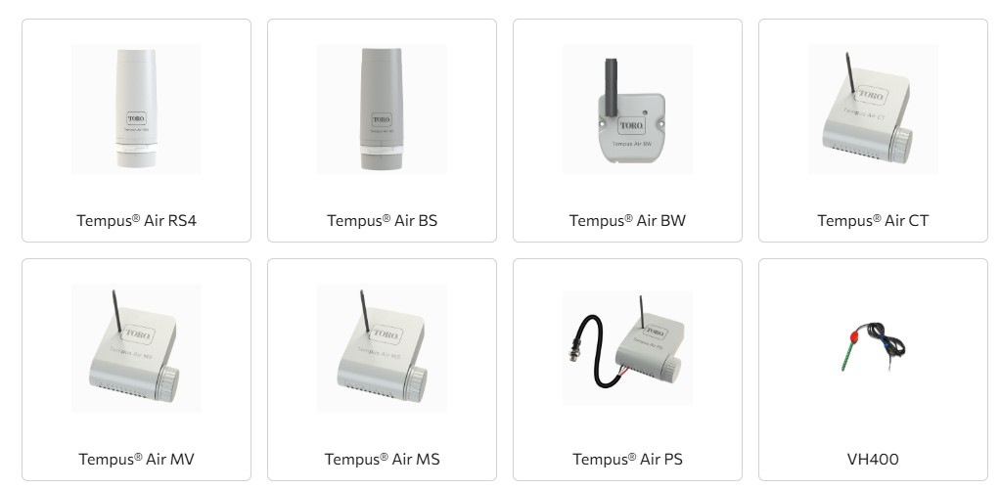

I prodotti vengono associati automaticamente quando li crei o modifichi. Vedi [Gestire i Prodotti](03-prodotti.md).