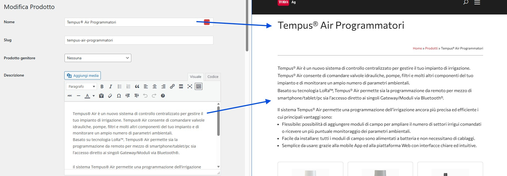
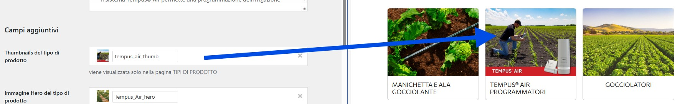
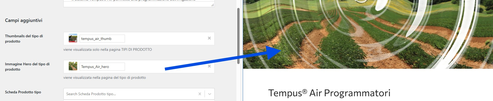

# Gestire i Tipi di Prodotto

I **Tipi di Prodotto** sono le categorie principali che raggruppano i tuoi prodotti (es. "Manichetta e Ala Gocciolante", "Tempus® Air Programmatori", "Gocciolatori").

## Dove si Vedono i Tipi di Prodotto

**Sul sito pubblico:**
- Pagina archivio: `https://www.toro-ag.it/prodotti/`
- Singola categoria: `https://www.toro-ag.it/prodotti/manichetta-e-ala-gocciolante/`

**Nell'amministrazione:**
- Menu → **Prodotti** → **Tipo di Prodotti**

---

## Come i Campi Custom Appaiono sul Sito

Ogni campo che compili nell'amministrazione ha una corrispondenza precisa nel frontend. Ecco la mappa completa:

### Nome e Descrizione → Titolo e Contenuto Pagina

Il **Nome** del tipo diventa il **titolo principale** della pagina, mentre la **Descrizione** diventa il testo introduttivo.

### Thumbnail → Griglia Tipi di Prodotto

La **Thumbnail** (miniatura) appare nella griglia della pagina `/prodotti/` quando si visualizzano tutti i tipi di prodotto.

### Immagine Hero → Header Pagina Tipo

L'**Immagine Hero** diventa l'immagine grande in cima alla pagina del singolo tipo di prodotto.

### Schede e Documenti → Sezioni Download

Le **Schede Prodotto** e i **Documenti** associati appaiono come link scaricabili organizzati in sezioni dedicate nella pagina del tipo.

### Video → Player Video nella Pagina

I **Video** associati vengono mostrati con un player integrato (YouTube) nella pagina del tipo di prodotto.

---

## Visualizzare Tipi Esistenti

1. Nel menu laterale, vai su **Prodotti** → **Tipo di Prodotti**
2. Vedrai la lista di tutti i tipi esistenti

Ogni tipo mostra:
- **Nome** (es. "Manichetta e Ala Gocciolante")
- **Slug** (URL-friendly, es. "manichetta-e-ala-gocciolante")
- **Descrizione**
- **Numero prodotti** associati

---

## Creare un Nuovo Tipo di Prodotto {#creare-nuovo-tipo}

### Passo 1: Andare alla Creazione

1. Vai su **Prodotti** → **Tipo di Prodotti**
2. Clicca su **"Aggiungi nuovo Tipo di Prodotti"** in alto

### Passo 2: Compilare le Informazioni Base

**Campi obbligatori:**
- **Nome**: Il nome che apparirà sul sito (es. "Tempus® Air Programmatori")
- **Slug**: Si genera automaticamente, ma puoi modificarlo
- **Descrizione**: Spiegazione che apparirà nella pagina del tipo

💡 **Suggerimento Slug**: Usa solo lettere minuscole, numeri e trattini. Es: "tempus-air-programmatori"

### Passo 3: Aggiungere Immagini

**Thumbnail (Miniatura)**
- Usata nelle pagine di archivio (vedi screenshot sopra)
- Dimensione consigliata: 400x300 pixel
- Clicca **"Aggiungi file"** nel campo "Thumbnails del tipo di prodotto"

**Immagine Hero**
- Usata nella pagina del singolo tipo di prodotto (vedi screenshot sopra)
- Dimensione consigliata: 1200x400 pixel
- Clicca **"Aggiungi file"** nel campo "Immagine Hero del tipo di prodotto"

### Passo 4: Salvare

1. Clicca **"Aggiungi nuovo Tipo di Prodotti"** in basso
2. Il sistema confermerà che il tipo è stato creato

✅ **Risultato**: Il nuovo tipo sarà visibile su `https://www.toro-ag.it/prodotti/`

---

## Modificare un Tipo Esistente {#modificare-tipo-esistente}

### Trovare il Tipo da Modificare

1. Vai su **Prodotti** → **Tipo di Prodotti**
2. Cerca il tipo nella lista
3. Clicca su **"Modifica"** sotto il nome

### Modificare le Informazioni

Puoi cambiare:
- **Nome e descrizione**
- **Immagini** (thumbnail e hero)
- **Video associati** (se presenti)
- **Documenti collegati**

⚠️ **Attenzione**: Se cambi lo "Slug", cambierà anche l'URL della pagina. Assicurati di aggiornare eventuali link interni.

### Salvare le Modifiche

1. Modifica i campi che ti servono
2. Clicca **"Aggiorna"** in basso
3. Controlla il risultato sul sito

---

## Associare Immagini e Documenti {#immagini-documenti}

### Video (Opzionale)

Se hai video per questo tipo di prodotto (vedi screenshot "Video" sopra):

1. Vai al campo **"Video"**
2. Clicca **"Aggiungi nuovo"** se non esistono video
3. Seleziona video esistenti dalla lista

### Schede Prodotto

Per associare schede tecniche (vedi screenshot "Schede e Documenti" sopra):

1. Campo **"Scheda Prodotto tipo"**
2. Seleziona dalle schede esistenti
3. Puoi selezionarne più di una tenendo premuto Ctrl

### Documenti Aggiuntivi

1. Campo **"Documento Prodotto Tipo"**
2. Seleziona documenti dalla lista
3. Puoi aggiungere più documenti

💡 **Suggerimento**: Se il documento che ti serve non esiste, devi prima crearlo nella sezione appropriata. Vedi il capitolo [Gestione Documenti Multilingua](07-documenti-multilingua.md).

---

## Eliminare un Tipo di Prodotto

⚠️ **Attenzione**: Elimina un tipo solo se sei sicuro. I prodotti associati non saranno eliminati, ma perderanno la categoria.

1. Vai alla lista dei tipi
2. Passa il mouse sul tipo da eliminare
3. Clicca **"Elimina"**
4. Conferma l'operazione

---

## Problemi Comuni

**Il tipo non appare sul sito**
- Controlla che sia stato salvato/pubblicato
- Verifica che ci siano prodotti associati al tipo

**Le immagini non si vedono**
- Verifica che le immagini siano state caricate correttamente
- Controlla le dimensioni consigliate

**L'URL non funziona**
- Controlla lo "slug" che sia corretto
- Prova ad andare su Impostazioni → Permalink e clicca "Salva" per aggiornare

---

**Prossimo**: [Gestire i Prodotti →](03-prodotti.md)