# Gestire i Prodotti

I **Prodotti** sono i singoli elementi del tuo catalogo (es. "Aqua-Traxx® FlowControl™", "Tempus® Air RS4").
Ogni prodotto viene assegnato a un Tipo di Prodotto e può essere associato a una o più Applicazioni (colture).

---

## Dove si Vedono i Prodotti

**Sul sito pubblico:**
- Nelle pagine dei tipi: <a href="https://www.toro-ag.it/prodotti/manichetta-e-ala-gocciolante/" target="_blank">https://www.toro-ag.it/prodotti/manichetta-e-ala-gocciolante/</a>
- Pagina prodotto singolo: <a href="https://www.toro-ag.it/prodotti/manichetta-e-ala-gocciolante/aqua-traxx-flowcontrol/" target="_blank">https://www.toro-ag.it/prodotti/manichetta-e-ala-gocciolante/aqua-traxx-flowcontrol/</a>

## Accedere alla Modifica dei Prodotti

### Dal Sito Pubblico

Nella pagina del prodotto, se loggato come Admin, clicca su **"Modifica Prodotto"** per accedere alla maschera di modifica del prodotto.

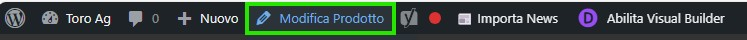

⚠️ **Attenzione**: Non abilitare il Visual Builder di Divi durante la modifica, altrimenti potresti compromettere la formattazione della pagina.

### Nell'Amministrazione

Clicca su **"Prodotti"** nella barra laterale per visualizzare l'elenco di tutti i prodotti.

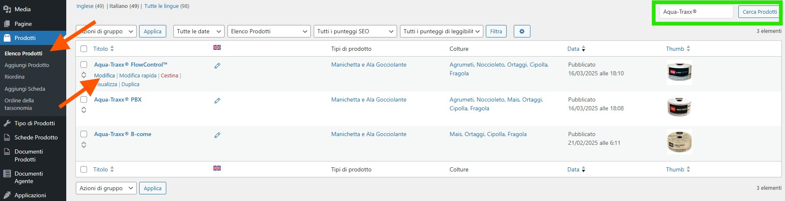

#### Cercare un Prodotto

Usa il campo di ricerca in alto a destra per trovare rapidamente un prodotto specifico.

#### Modificare un Prodotto

Clicca su **"Modifica"** sotto il nome del prodotto che vuoi modificare.

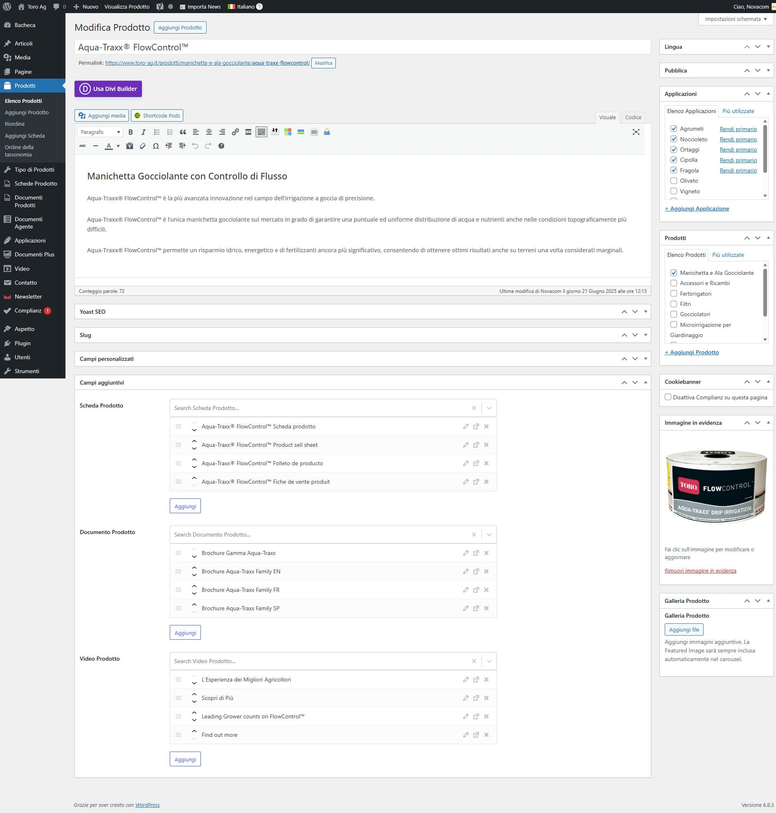

---

## Come i Campi Custom Appaiono sul Sito

Di seguito la corrispondenza tra gli elementi visualizzati nel frontend e i singoli campi da compilare nel backend.

### Titolo

**Nel frontend:**

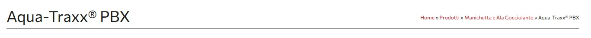

**Nel backend:**

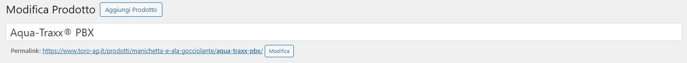

Modifica il campo **"Titolo"** nella parte superiore dell'editor (funzionamento standard WordPress).

---

### Descrizione

**Nel frontend:**

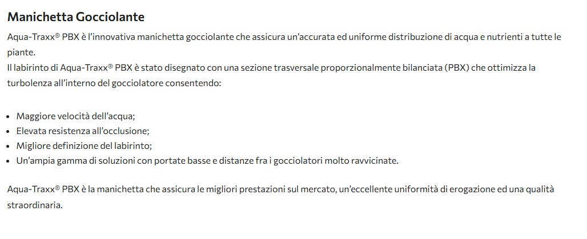

**Nel backend:**

Usa l'editor principale con formattazione Rich Text per inserire la descrizione completa del prodotto con tutte le informazioni tecniche (editor standard WordPress).

---

### Immagine in Evidenza

L'immagine in evidenza viene utilizzata in due contesti:
- Nelle **griglie dei prodotti** (pagine archivio dei tipi di prodotto)
- Nella **pagina del singolo prodotto**

**Nel frontend - Pagina singolo prodotto:**

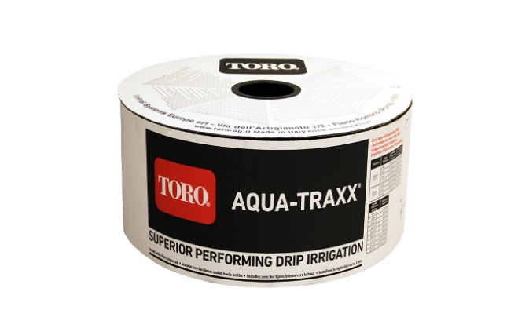

**Nel frontend - Griglia prodotti:**

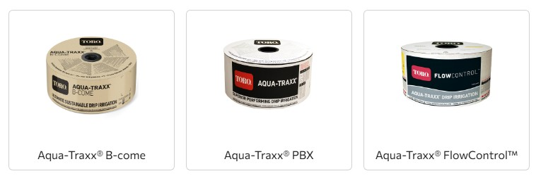

**Nel backend:**

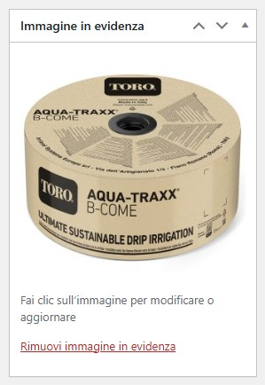

Nella colonna destra, nella box **Immagine in evidenza** clicca l'immagine per aprire la galleria dei Media e sceglierne un'altra o su **"Rimuovi immagine in evidenza"**. Dimensione consigliata: 800 x 800px.

---

### Tipo di Prodotto

**Nel frontend:**

Il Tipo di Prodotto determina la categoria principale e la struttura URL del prodotto.

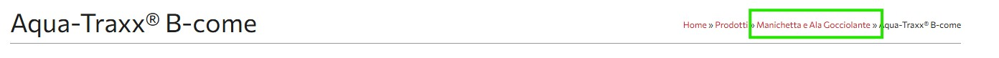

**Nel backend:**

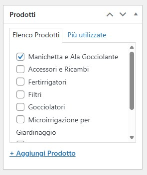

Nella colonna destra, seleziona il **"Tipo di Prodotto"** appropriato (es. "Manichetta e Ala Gocciolante", "Gocciolatori", "Tempus® Air Programmatori").

⚠️ **Importante**: Il prodotto apparirà nella pagina archivio del tipo selezionato.

---

### Applicazioni

**Nel frontend:**

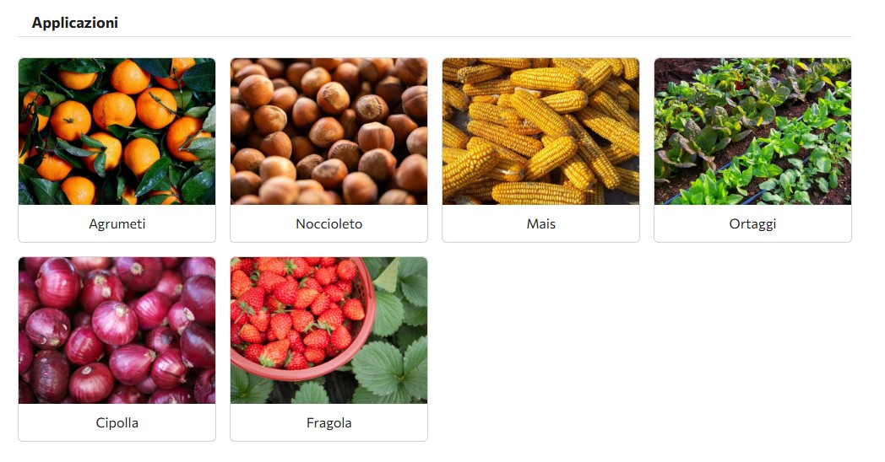

**Nel backend:**

Nella colonna destra, seleziona una o più **"Applicazioni"** (es. Agrumeti, Noccioleto, Ortaggi, Cipolla, Fragola, Vigneto).

💡 Puoi selezionare più applicazioni per lo stesso prodotto.

---

### Schede Prodotto

**Nel frontend:**

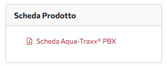

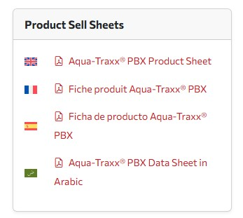

**Nel backend:**

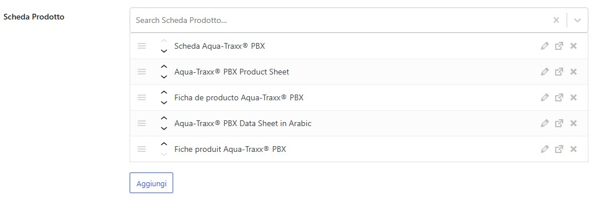

Seleziona le schede tecniche dal campo **"Scheda Prodotto"**. Clicca **"Aggiungi"** per cercare e selezionare le schede esistenti.

💡 Per gestire i file delle schede, vedi [Allegati Multilingua](05-allegati-multilingua.md).

---

### Documenti Prodotto

**Nel frontend:**

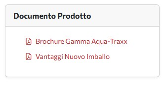

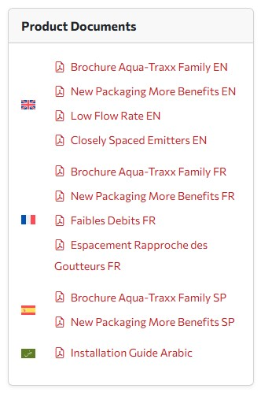

**Nel backend:**

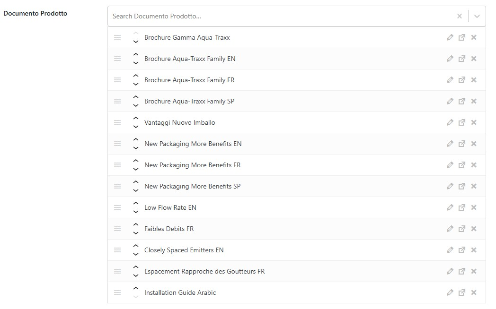

Seleziona brochure e documenti dal campo **"Documento Prodotto"**. Clicca **"Aggiungi"** per cercare e selezionare i documenti esistenti.

💡 Per gestire i file dei documenti, vedi [Allegati Multilingua](05-allegati-multilingua.md).

---

### Video Prodotto

**Nel frontend:**

**Nel backend:**

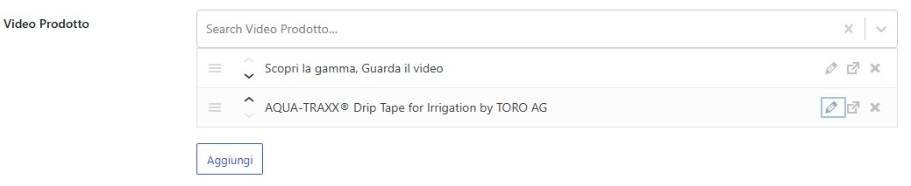

Seleziona i video dimostrativi dal campo **"Video Prodotto"**. Clicca **"Aggiungi"** per cercare e selezionare i video esistenti.

💡 Per gestire i video, vedi [Allegati Multilingua](05-allegati-multilingua.md).

---

## Funzionalità Opzionali

Le seguenti funzionalità sono disponibili ma non utilizzate in tutti i prodotti. Configurale solo se necessario per casi specifici.

### Galleria Prodotto

**Nel frontend:**

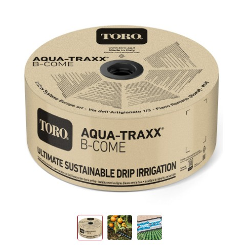

**Nel backend:**

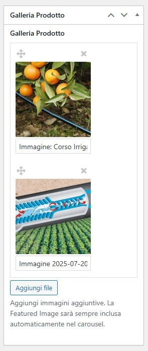

Nella colonna destra, clicca **"Aggiungi file"** nel campo **"Galleria Prodotto"** per aggiungere immagini aggiuntive al carousel.

💡 L'immagine in evidenza viene inclusa automaticamente nel carousel.

📌 **Nota**: Questa funzionalità è attualmente utilizzata solo come prova nel prodotto <a href="https://www.toro-ag.it/prodotti/manichetta-e-ala-gocciolante/aqua-traxx-b-come/" target="_blank">Aqua-Traxx® B-Come</a>.

---

### Pulsante "Attivalo Ora"

**Nel frontend:**

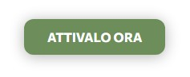

**Nel backend:**

Questo pulsante richiede particolare attenzione nella configurazione del codice HTML.

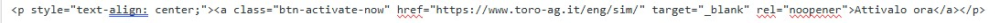

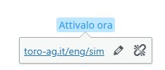

⚠️ **ATTENZIONE**: È fondamentale mantenere il codice HTML corretto durante la modifica. Se il codice viene alterato, gli stili CSS del pulsante non funzioneranno correttamente.

**Best practice:**
- Modifica il pulsante in modalità "Code" (non WYSIWYG)
- Non copiare/incollare da altri editor che potrebbero alterare il markup
- Verifica sempre il risultato nel frontend dopo le modifiche

---

**Prossimo**: [Gestire le Applicazioni →](04-applicazioni.md)
