# Gestire le Applicazioni

Le **Applicazioni** (chiamate anche Colture) rappresentano gli ambiti di utilizzo dei tuoi prodotti (es. "Agrumeti", "Vigneto", "Mais", "Colture Protette").
Questa tassonomia permette di organizzare i prodotti per tipo di coltivazione e creare una connessione bidirezionale: i prodotti mostrano le applicazioni per cui sono adatti, e le applicazioni mostrano i prodotti disponibili.

---

## Dove si Vedono le Applicazioni

**Sul sito pubblico:**
- Pagina archivio: <a href="https://www.toro-ag.it/applicazioni/" target="_blank">https://www.toro-ag.it/applicazioni/</a>
- Singola applicazione: <a href="https://www.toro-ag.it/applicazioni/irrigazione-fragola/" target="_blank">https://www.toro-ag.it/applicazioni/irrigazione-fragola/</a>

**Accedere alla modifica delle applicazioni**

**Nell'amministrazione:**

Clicca su **"Applicazioni"** nella barra laterale per visualizzare l'elenco di tutte le applicazioni.

<div data-with-frame="true">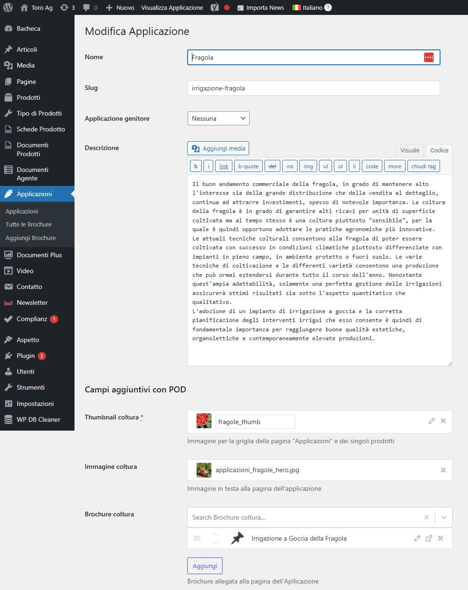</div>

**Cercare un'applicazione**

Usa il campo di ricerca in alto a destra per trovare rapidamente un'applicazione specifica.

**Modificare un'applicazione**

Clicca su **"Modifica"** sotto il nome dell'applicazione che vuoi modificare.

<div data-with-frame="true"></div>

---

## Come i Campi Custom Appaiono sul Sito

Di seguito la corrispondenza tra gli elementi visualizzati nel frontend e i singoli campi da compilare nel backend.

### Nome

**Nel frontend - Pagina archivio:**

<div data-with-frame="true">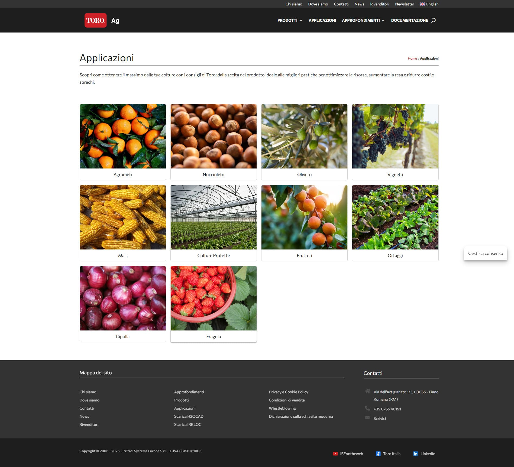</div>

**Nel frontend - Pagina singola:**

<div data-with-frame="true">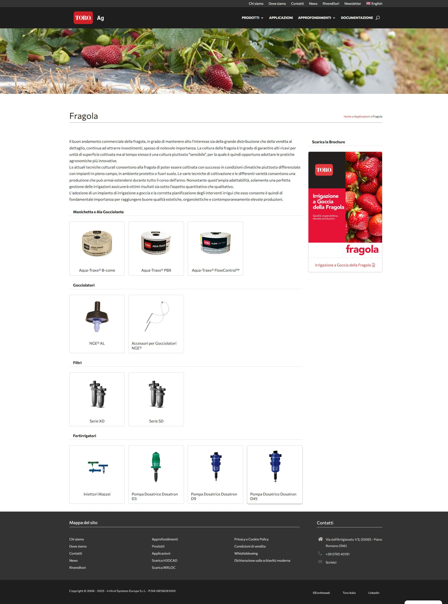</div>

**Nel backend:**

<div data-with-frame="true"></div>

Modifica il campo **"Nome"** nella parte superiore del form (es. "Fragola", "Agrumeti", "Vigneto").

💡 Lo **Slug** viene generato automaticamente dal nome, ma puoi personalizzarlo se necessario.

---

### Descrizione

La descrizione breve viene utilizzata nelle pagine di archivio e nelle anteprime.

**Nel frontend:**

<div data-with-frame="true">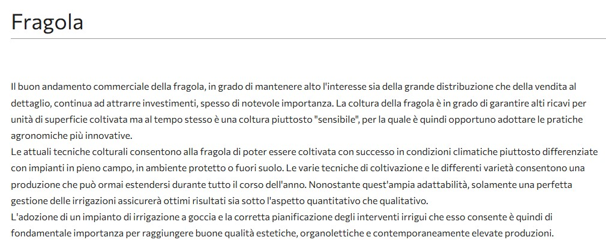</div>

**Nel backend:**

<div data-with-frame="true">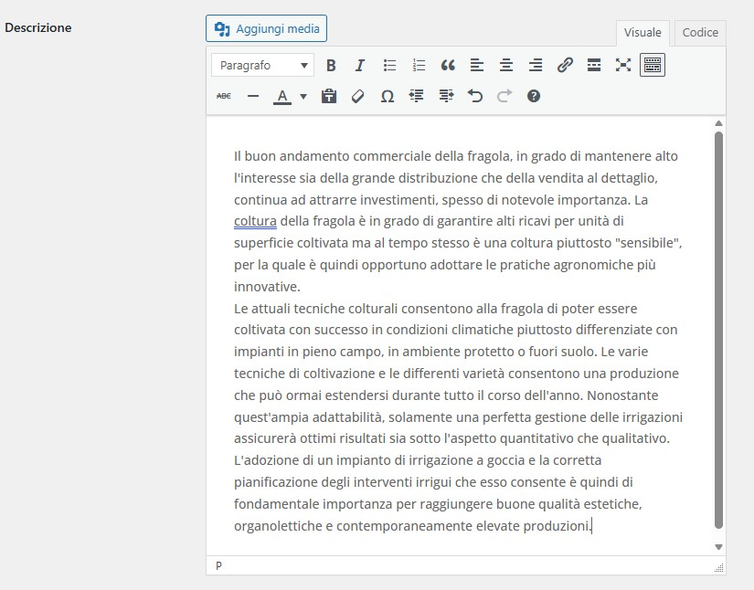</div>

Usa l'editor **"Descrizione"** con formattazione Rich Text per inserire una descrizione breve ma esaustiva dell'applicazione.

---

### Thumbnail Coltura

L'immagine thumbnail è utilizzata nella griglia delle applicazioni (pagina archivio) e nelle liste.

**Nel frontend:**

<div data-with-frame="true">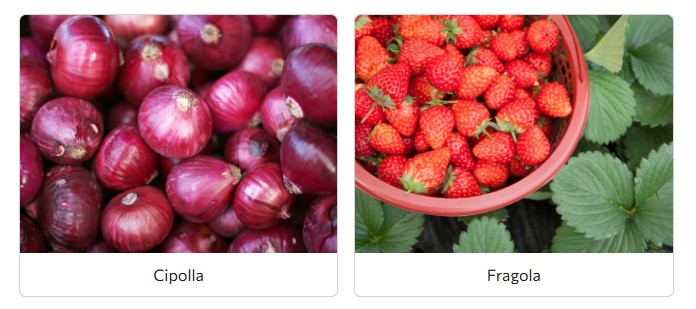</div>

**Nel backend:**

<div data-with-frame="true">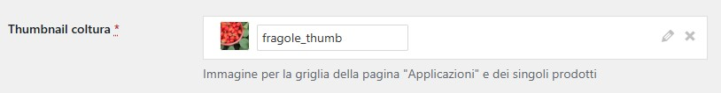</div>

Nel campo **"Thumbnail coltura"** clicca **"Aggiungi file"** per selezionare o caricare l'immagine.

⚠️ **Importante**: Questo campo è **obbligatorio** (contrassegnato con asterisco rosso). L'applicazione non verrà visualizzata correttamente senza una thumbnail.

💡 Dimensione consigliata: 400 x 300px.

---

### Immagine Coltura (Hero)

L'immagine hero è la grande immagine visualizzata nella parte superiore della pagina singola dell'applicazione.

**Nel frontend:**

<div data-with-frame="true">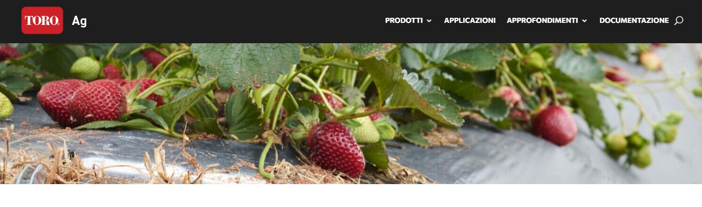</div>

**Nel backend:**

<div data-with-frame="true">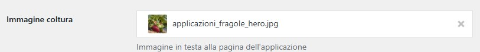</div>

Nel campo **"Immagine coltura"** clicca per selezionare l'immagine hero.

💡 Dimensione consigliata: 1200 x 400px.

📌 **Nota**: Questo campo è opzionale ma fortemente consigliato per una migliore presentazione visiva.

---

### Descrizione Coltura

La descrizione dettagliata fornisce informazioni complete sull'applicazione e appare nella pagina singola.

**Nel frontend:**

<div data-with-frame="true"></div>

**Nel backend:**

<div data-with-frame="true"></div>

Usa l'editor Rich Text per inserire una descrizione completa con:
- Caratteristiche specifiche della coltura
- Consigli di utilizzo
- Informazioni tecniche
- Formattazione avanzata (grassetto, elenchi, link, etc.)

💡 La descrizione dettagliata è diversa dalla descrizione breve - qui puoi essere più esaustivo.

---

### Brochure Coltura

Associa brochure e documenti specifici per questa applicazione.

**Nel frontend:**

<div data-with-frame="true">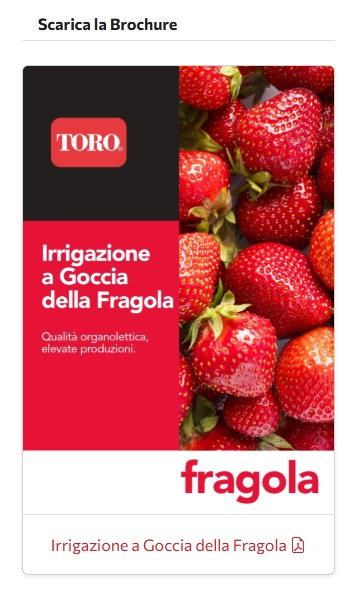</div>

Le brochure appaiono nella sidebar della pagina singola dell'applicazione, pronte per il download.

**Nel backend:**

<div data-with-frame="true">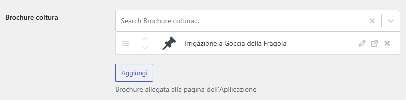</div>

Nel campo **"Brochure coltura"** cerca e seleziona le brochure esistenti. Puoi associarne più di una.

💡 Le brochure devono essere create prima nella sezione **"Tutte le Brochure"** → **"Brochure Colture"**.

💡 Clicca **"Aggiungi"** per aggiungere nuove brochure alla selezione.

---

### Applicazione Genitore

Per creare una struttura gerarchica, puoi definire applicazioni "padre" e "figlie".

**Esempio di gerarchia:**
```
Frutteti (principale)
├── Agrumeti
├── Noccioleto
└── Oliveto

Ortaggi (principale)
├── Cipolla
└── Fragola
```

**Nel backend:**

<div data-with-frame="true"></div>

Nel campo **"Applicazione genitore"** seleziona l'applicazione principale se questa è una sotto-categoria.

💡 Lascia su "Nessuna" se questa è una categoria principale.

⚠️ **Attenzione**: Cambiare la gerarchia può modificare l'URL dell'applicazione.

---

### Prodotti Associati

I prodotti vengono associati automaticamente quando li crei o modifichi.

**Nel frontend:**

<div data-with-frame="true">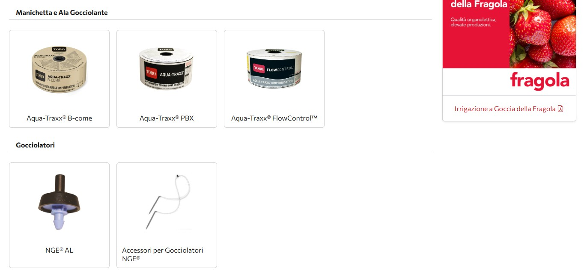</div>

Nella pagina dell'applicazione, i prodotti sono automaticamente organizzati per tipo (Manichetta e Ala Gocciolante, Gocciolatori, Filtri, etc.).

**Associazione bidirezionale:**
- Quando associ un'applicazione a un prodotto, il prodotto appare automaticamente nella pagina dell'applicazione
- L'applicazione appare nella pagina del prodotto con la relativa icona

💡 Per associare prodotti a un'applicazione, vai su **Prodotti** → **Modifica prodotto** → seleziona le applicazioni nel campo **"Applicazioni"**.

💡 Per vedere quanti prodotti sono associati, guarda la colonna **"Conteggio"** nella lista delle applicazioni.

---

## Note Importanti

**Campo obbligatorio:**
- La **Thumbnail Coltura** è l'unico campo obbligatorio contrassegnato con asterisco rosso
- Senza thumbnail, l'applicazione non verrà visualizzata correttamente nella griglia

**Organizzazione gerarchica:**
- Usa il campo "Applicazione genitore" per creare sotto-categorie
- La gerarchia aiuta a organizzare meglio le applicazioni correlate
- Evita cicli (A padre di B, B padre di A)

**Collegamento con prodotti:**
- I prodotti devono essere associati dall'editor del singolo prodotto
- Il collegamento è bidirezionale: modifica in un punto, appare in entrambi
- I prodotti sono automaticamente raggruppati per tipo nella pagina dell'applicazione

---

**Prossimo**: [Allegati Multilingua →](05-allegati-multilingua.md)
