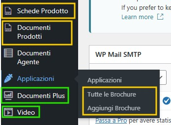
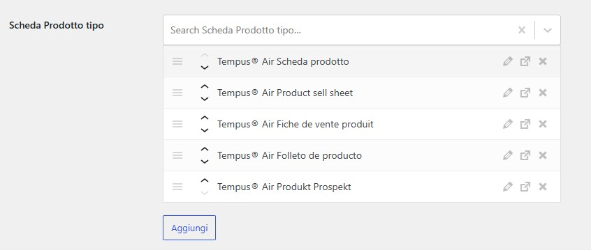
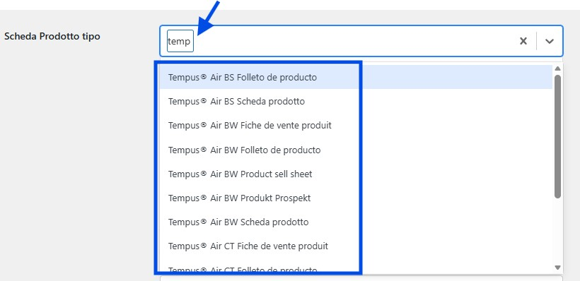
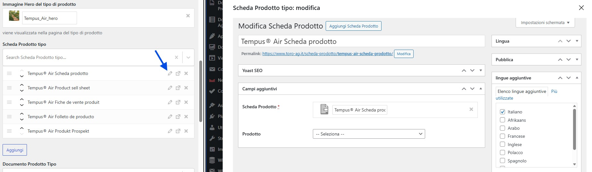
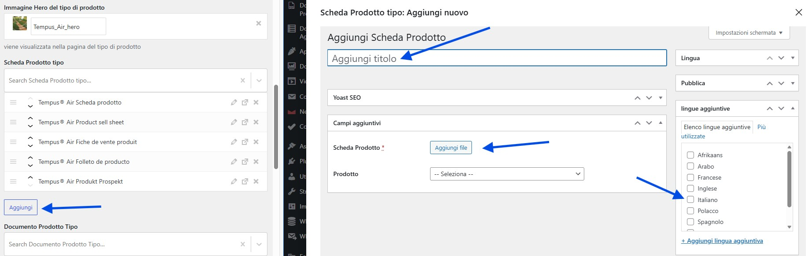
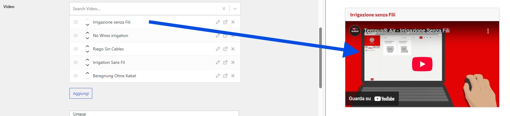

# Allegati Multilingua (Documenti, Brochure, Video)

Gli allegati sono file PDF, documenti o video che possono essere associati ai prodotti e alle applicazioni. Il sistema gestisce automaticamente la visualizzazione in base alla lingua del sito.

---

## Dove trovarli

Nel menu laterale di WordPress trovi 5 tipologie di allegati:

**Gestiti allo stesso modo** (evidenziati in giallo):
- **Schede Prodotto** - Schede tecniche PDF
- **Documenti Prodotti** - Brochure, manuali, certificazioni
- **Tutte le Brochure** - Documenti per applicazioni/colture

**Gestione dedicata** (evidenziati in verde):
- **Documenti Plus** - Documenti aggiuntivi con icone personalizzate
- **Video** - Video YouTube multilingua

---

## Come Funziona il Sistema Multilingua

Ogni allegato ha un campo **"Lingua"** che determina dove viene mostrato:

**🇮🇹 Versione italiana** (`www.toro-ag.it`)
- Mostra SOLO allegati con lingua = **"italiano"**

**🌍 Versione inglese** (`www.toro-ag.it/en/`)
- Mostra allegati con lingua ≠ "italiano"
- Raggruppa per lingua (inglese, francese, tedesco, spagnolo, ecc.)

⚠️ **Importante**: Seleziona sempre la lingua corretta quando crei o modifichi un allegato!

---

## Interfaccia di Gestione

L'interfaccia è identica per **Schede Prodotto**, **Documenti Prodotti** e **Brochure**.

### Panoramica elementi associati

Quando modifichi un prodotto o tipo di prodotto vedi:
- Lista degli allegati già associati
- Pulsante **"Aggiungi"** per nuove associazioni
- Icone per modificare o rimuovere

### Associare un allegato esistente

**Per associare un file già esistente:**
1. Clicca sul campo di ricerca
2. Digita per filtrare (es. "temp" per trovare "Tempus")
3. Seleziona dall'elenco

💡 **Suggerimento**: Usa nomi descrittivi che includono il nome del prodotto per trovarli facilmente.

### Modificare un allegato

**Dalla lista allegati:**
1. Clicca sull'icona matita ✏️
2. Si apre il pannello di modifica con:
   - **Titolo** - Nome dell'allegato
   - **File PDF** - Upload o sostituzione file
   - **Lingua** - Selezione lingua principale
   - **Lingue aggiuntive** - Altre lingue disponibili
   - **Prodotto** - Associazione prodotto (se necessario)
   - **Campi SEO** - Ottimizzazione motori di ricerca

### Creare un nuovo allegato

**Dall'editor prodotto/tipo:**
1. Clicca **"Aggiungi"** nella sezione allegati
2. Compila:
   - **Titolo** - Nome descrittivo (es. "Tempus® Air Scheda prodotto")
   - **File** - Clicca "Aggiungi file" e carica PDF
   - **Prodotto** - Seleziona dal menu
   - **Lingua** - ⚠️ **Fondamentale!** Seleziona la lingua corretta
3. Clicca **"Pubblica"**

Il nuovo allegato viene automaticamente associato al prodotto che stai modificando.

---

## Schede Prodotto

**Custom Post Type:** `scheda_prodotto`

**Uso tipico:** Schede tecniche dettagliate in formato PDF

**Dove appare:** Sezione "Scheda Prodotto" nella pagina prodotto

**Come gestire:**
1. Menu **Schede Prodotto** → Aggiungi nuovo
2. Carica PDF scheda tecnica
3. Seleziona lingua
4. Associa a prodotto o tipo di prodotto

**Best practice nomenclatura:**
- IT: `[Nome Prodotto] Scheda prodotto`
- EN: `[Product Name] Datasheet`
- ES: `[Nombre] Ficha de producto`

---

## Documenti Prodotti

**Custom Post Type:** `documenti_prodotto`

**Uso tipico:** Brochure commerciali, manuali utente, certificazioni

**Dove appare:** Sezione "Documenti Prodotto" nella pagina prodotto

**Formati supportati:** PDF, DOC, DOCX

**Come gestire:**
1. Menu **Documenti Prodotti** → Aggiungi nuovo
2. Carica file documento
3. (Opzionale) Specifica tipo documento: Brochure, Manuale, Certificazione
4. Seleziona lingua
5. Associa a prodotto o tipo di prodotto

**Best practice nomenclatura:**
- IT: `[Nome Prodotto] Descrizione generale`
- EN: `[Product Name] General Description`

---

## Brochure (Applicazioni)

**Custom Post Type:** `brochure_coltura`

**Uso tipico:** Documenti specifici per applicazioni/colture

**Dove appare:** Pagina dell'Applicazione associata

**Come gestire:**
1. Menu **Applicazioni** → **Tutte le Brochure** → Aggiungi nuovo
2. Carica PDF brochure
3. Seleziona lingua
4. Associa a una o più applicazioni

**Associazione:**
- Da **Applicazioni** → Modifica → Sezione "Brochure coltura"
- Seleziona le brochure pertinenti

---

## Documenti Plus

**Custom Post Type:** `documenti_plus`

**Caratteristica speciale:** Supporta icone personalizzate

**Uso tipico:** Documenti con icone custom (awards, certificazioni speciali, ecc.)

**Campi aggiuntivi:**
- **Icona** - Upload immagine icona personalizzata
- **Link esterno** - URL documento (alternativo al file)
- **Descrizione breve** - Testo che appare accanto all'icona

**Come gestire:**
1. Menu **Documenti Plus** → Aggiungi nuovo
2. Compila titolo e descrizione
3. Carica file PDF oppure inserisci link esterno
4. Carica icona personalizzata (consigliato: 64x64px, PNG trasparente)
5. Seleziona lingua
6. Associa a prodotto

💡 **Suggerimento**: Usa Documenti Plus per dare risalto visivo a documenti speciali.

---

## Video

**Custom Post Type:** `video`

**Uso tipico:** Video dimostrativi, tutorial, presentazioni YouTube

**Dove appare:** Sezione "Video" nella pagina prodotto, con player integrato

**Campi da compilare:**
- **Titolo** - Nome descrittivo (es. "Tempus® Air - Irrigazione Senza Fili")
- **URL Video** - Link YouTube completo: `https://www.youtube.com/watch?v=XXXXXXXXX`
- **Lingua** - Lingua dell'audio/sottotitoli
- **Descrizione** - Breve descrizione contenuto (opzionale)

**Come gestire:**
1. Menu **Video** → Aggiungi nuovo
2. Inserisci URL YouTube
3. Seleziona lingua dell'audio/sottotitoli
4. Associa a prodotto o tipo di prodotto

**Associazione:**
- **Prodotti**: Modifica prodotto → Sezione "Video Prodotto"
- **Tipi di Prodotto**: Modifica tipo → Sezione "Video"

**Best practice nomenclatura:**
- IT: `[Nome Prodotto] - [Argomento]`
- EN: `[Product Name] - [Topic]`
- ES: `[Nombre] - [Tema]`

---

## Workflow: Aggiungere Allegato in Più Lingue

Se hai lo stesso documento in più versioni linguistiche:

**1. Crea documenti separati** per ogni lingua
   - "Tempus® Air Scheda prodotto" → Lingua: italiano
   - "Tempus® Air Product datasheet" → Lingua: inglese
   - "Tempus® Air Fiche de vente produit" → Lingua: francese

**2. Associali allo stesso prodotto/tipo**
   - Il sistema mostrerà automaticamente solo quelli pertinenti

**3. Usa nomi simili ma tradotti**
   - Aiuta a identificarli nell'admin

---

## Checklist Prima di Pubblicare

- ✅ **Lingua selezionata correttamente?**
- ✅ **File caricato corrisponde alla lingua dichiarata?**
- ✅ **Nome file/titolo descrittivo?**
- ✅ **Associato al prodotto/applicazione corretto?**
- ✅ **File PDF funzionante e non corrotto?**

---

## Problemi Comuni

### "L'allegato non appare sul sito italiano"

**Causa**: Lingua non impostata su "italiano"

**Soluzione:**
1. Modifica l'allegato
2. Cambia campo "Lingua" → "italiano"
3. Aggiorna

### "Video non si vede"

**Causa**: URL YouTube non corretto

**Soluzione:**
- Usa URL completo: `https://www.youtube.com/watch?v=CODICE`
- NON usare URL abbreviati o embed

### "Documento non appare nella lista di selezione"

**Causa**: Documento in bozza o non pubblicato

**Soluzione:**
1. Vai alla lista documenti
2. Verifica stato → deve essere "Pubblicato"

---

**Prossimo**: [Come collegare gli elementi →](06-associazioni.md)
