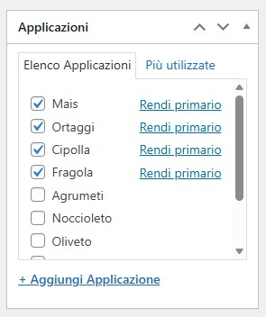

# Collegamenti e Associazioni

I collegamenti tra **Prodotti**, **Tipi di Prodotto** e **Applicazioni** determinano come i contenuti appaiono e si relazionano sul sito.

## Come Funzionano i Collegamenti

### Schema delle Relazioni

Il sistema di associazioni può essere visto da **tre prospettive diverse**. Tutte sono valide e rappresentano lo stesso sistema di collegamenti, ma viste da angolazioni differenti.

#### 🏷️ Prospettiva: dal Tipo di Prodotto

```
TIPO DI PRODOTTO (es. "Manichetta e Ala Gocciolante")
    ├── PRODOTTO A (es. "Aqua Traxx PBX")
    │   ├── Applicazione: Agrumeti
    │   ├── Applicazione: Vigneto
    │   └── Documenti: Scheda tecnica
    │
    └── PRODOTTO B (es. "Aqua Traxx FC")
        ├── Applicazione: Ortaggi
        └── Applicazione: Colture Protette
```

💡 **Cosa significa**: Un tipo di prodotto contiene più prodotti specifici, ognuno dei quali può essere usato in diverse applicazioni.

---

#### 🌱 Prospettiva: dall'Applicazione

```
APPLICAZIONE (es. "Vigneto")
    ├── PRODOTTO A (es. "Aqua Traxx PBX")
    │   ├── Tipo: Manichetta e Ala Gocciolante
    │   └── Documenti: Scheda tecnica
    │
    ├── PRODOTTO C (es. "Irritec Spray System")
    │   ├── Tipo: Microirrigazione
    │   └── Documenti: Brochure vigneto
    │
    └── PRODOTTO D (es. "Filter Pro V200")
        ├── Tipo: Filtrazione
        └── Documenti: Manuale tecnico
```

💡 **Cosa significa**: Un'applicazione mostra tutti i prodotti utilizzabili in quel settore, indipendentemente dal tipo a cui appartengono.

---

#### 📦 Prospettiva: dal Prodotto Singolo

```
PRODOTTO (es. "Aqua Traxx PBX")
    │
    ├── Tipo di Prodotto
    │   └── Manichetta e Ala Gocciolante (1 solo tipo)
    │
    ├── Applicazioni
    │   ├── Agrumeti
    │   ├── Vigneto
    │   └── Ortaggi (multiple applicazioni possibili)
    │
    └── Documenti e Contenuti
        ├── Scheda Prodotto: "Aqua Traxx PBX Technical"
        ├── Documento: "Guida installazione"
        └── Video: "Demo irrigazione"
```

💡 **Cosa significa**: Un prodotto appartiene a UN tipo, può essere usato in MULTIPLE applicazioni, e può avere MULTIPLI documenti associati.

### Risultato sul Sito

Quando crei questi collegamenti, le tre prospettive si riflettono nelle pagine del sito:

**Pagina Tipo di Prodotto** (es. <a href="https://www.toro-ag.it/prodotti/manichetta-e-ala-gocciolante/" target="_blank">manichetta-e-ala-gocciolante</a>)
- Mostra tutti i prodotti di quel tipo
- Lista le applicazioni coperte dai prodotti del tipo
- Documenti comuni al tipo

**Pagina Applicazione** (es. <a href="https://www.toro-ag.it/applicazioni/irrigazione-agrumeti/" target="_blank">irrigazione-agrumeti</a>)
- Mostra tutti i prodotti utilizzabili per quel settore
- Raggruppa prodotti di tipi diversi
- Brochure e documenti specifici per l'applicazione

**Pagina Prodotto** (es. <a href="https://www.toro-ag.it/prodotti/manichetta-e-ala-gocciolante/aqua-traxx-flowcontrol/" target="_blank">aqua-traxx-flowcontrol</a>)
- Mostra il tipo di appartenenza
- Lista tutte le applicazioni possibili
- Tutti i documenti, schede e video associati

💡 **In pratica**: Ogni pagina mostra le stesse relazioni, ma da una prospettiva diversa, permettendo all'utente finale di navigare in modo intuitivo da qualsiasi punto di partenza.

### Regole Chiave delle Relazioni

| Elemento | Tipo di Prodotto | Applicazioni | Documenti |
|----------|------------------|--------------|-----------|
| **Prodotto** | 1️⃣ UNO solo (obbligatorio) | ♾️ MULTIPLE (opzionale) | ♾️ MULTIPLI (opzionale) |
| **Tipo di Prodotto** | — | — | ♾️ MULTIPLI (opzionale) |
| **Applicazione** | — | — | ♾️ MULTIPLI (opzionale) |

**Cosa ricordare:**
- ✅ Ogni prodotto deve avere ESATTAMENTE un tipo di prodotto
- ✅ Un prodotto può avere zero, una o molte applicazioni
- ✅ Documenti e video possono essere associati a prodotti, tipi o applicazioni
- ❌ Un prodotto NON può avere più tipi contemporaneamente
- ❌ Non esiste un limite al numero di applicazioni o documenti

---

## Collegare Prodotti e Tipi di Prodotto {#prodotti-tipi}

I **Tipi di Prodotto** sono una tassonomia WordPress. Ogni prodotto deve essere associato a un tipo.

Nell'editor del prodotto, trovi il box **"Tipo di Prodotto"** nella colonna destra. Seleziona UNA categoria (obbligatoria).


**Importante**: Senza un tipo di prodotto associato, il prodotto non apparirà correttamente sul sito.



---

## Collegare Prodotti e Applicazioni {#prodotti-applicazioni}

Le **Applicazioni** sono una tassonomia WordPress. Un prodotto può essere associato a più applicazioni.

Nell'editor del prodotto, trovi il box **"Applicazioni"** nella colonna destra. Seleziona una o più applicazioni (opzionale, ma consigliato).



---

## Collegare Documenti e Contenuti {#documenti-contenuti}

Per la creazione e gestione dei documenti, consulta la pagina [Allegati Multilingua](05-allegati-multilingua.md).

Questa sezione mostra solo **lo schema delle relazioni** tra documenti e contenuti.

### Schema Relazioni Documenti → Contenuti

**📄 Schede Prodotto**
- ✅ Associabili a **Prodotti** (multi)
- ✅ Associabili a **Tipi di Prodotto** (multi)
- ✅ Associabili a **Pagine** (multi)
- *❌ NON associabili ad Applicazioni*

**📑 Documenti Prodotto**
- ✅ Associabili a **Prodotti** (multi)
- ✅ Associabili a **Tipi di Prodotto** (multi)
- ✅ Associabili a **Pagine** (multi)
- *❌ NON associabili ad Applicazioni*

**🌾 Brochure Coltura**
- *❌ NON associabili a Prodotti*
- *❌ NON associabili a Tipi*
- *❌ NON associabili a Pagine*
- ✅ Associabili solo ad **Applicazioni** (multi)

**🎥 Video**
- ✅ Associabili a **Prodotti** (multi)
- ✅ Associabili a **Tipi di Prodotto** (multi)
- ✅ Associabili a **Pagine** (multi)
- *❌ NON associabili ad Applicazioni*

**🖼️ Documenti Plus**
- *❌ NON associabili a Prodotti*
- *❌ NON associabili a Tipi*
- ✅ Associabili solo a **Pagine** (multi)
- *❌ NON associabili ad Applicazioni*

---

### Schema Relazioni Contenuti → Documenti

**📦 Prodotti**
- ✅ Possono avere **Schede Prodotto** (multi)
- ✅ Possono avere **Documenti Prodotto** (multi)
- ✅ Possono avere **Video** (multi)
- *❌ NON possono avere Brochure Coltura*
- *❌ NON possono avere Documenti Plus*

**🏷️ Tipi di Prodotto**
- ✅ Possono avere **Schede Prodotto** (multi)
- ✅ Possono avere **Documenti Prodotto** (multi)
- ✅ Possono avere **Video** (multi)
- *❌ NON possono avere Brochure Coltura*
- *❌ NON possono avere Documenti Plus*

**🌱 Applicazioni**
- *❌ NON possono avere Schede Prodotto*
- *❌ NON possono avere Documenti Prodotto*
- ✅ Possono avere **Brochure Coltura** (multi)
- *❌ NON possono avere Video*
- *❌ NON possono avere Documenti Plus*

**📄 Pagine**
- ✅ Possono avere **Schede Prodotto** (multi)
- ✅ Possono avere **Documenti Prodotto** (multi)
- ✅ Possono avere **Documenti Plus** (multi)
- ✅ Possono avere **Video** (multi)
- *❌ NON possono avere Brochure Coltura*

💡 **Regola chiave**: Tutte le associazioni sono **molti-a-molti** (multi). Un documento può essere associato a più elementi e viceversa.

---

**Prossimo**: [Domande Frequenti →](07-faq.md)