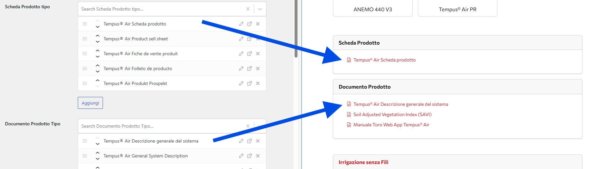

# Gestione Documenti e Contenuti Multilingua

I documenti allegati ai prodotti (schede tecniche, brochure, video) hanno una **gestione speciale della lingua** che permette di mostrare contenuti diversi in base alla versione del sito (italiana o inglese).

## Tipi di Contenuti Multilingua

Il sistema gestisce tre tipi di contenuti con supporto multilingua:

- **Schede Prodotto** (`scheda_prodotto`) - Schede tecniche dettagliate
- **Documenti Prodotto** (`documenti_prodotto`) - Brochure, manuali, certificazioni
- **Video** - Video dimostrativi o informativi
- **Brochure Colture** (`brochure_coltura`) - Documenti specifici per applicazioni

## Come Funziona il Sistema Multilingua

### Tassonomia "Lingua"

Ogni documento/video ha un campo **"Lingua"** che determina in quale versione del sito verrà mostrato:

**Versione italiana del sito** (`www.toro-ag.it`):
- Mostra SOLO i contenuti con lingua = **"italiano"**
- Nasconde tutti gli altri contenuti

**Versione inglese del sito** (`www.toro-ag.it/en/`):
- Mostra i contenuti con lingua ≠ "italiano"
- Raggruppa per lingua (inglese, francese, tedesco, spagnolo, ecc.)
- Permette di selezionare la lingua desiderata

Nell'immagine sopra vedi come i video sono organizzati con lingue diverse:
- "Irrigazione senza Fili" (italiano)
- "No Wires irrigation" (inglese)
- "Riego Sin Cables" (spagnolo)
- "Irrigation Sans Fil" (francese)
- "Beregnung Ohne Kabel" (tedesco)

---

## Gestire le Schede Prodotto

### Creare una Nuova Scheda

1. Nel menu laterale, vai su **Schede Prodotto**
2. Clicca **"Aggiungi nuovo"**

**Campi da compilare:**

**Titolo**
- Nome descrittivo della scheda (es. "Tempus® Air Scheda prodotto")

**File PDF**
- Carica il file PDF della scheda tecnica
- Clicca **"Aggiungi file"** e seleziona il PDF dal tuo computer

**Lingua** ⚠️ **IMPORTANTE**
- Seleziona la lingua del documento
- **"italiano"** → apparirà solo nella versione italiana
- Altre lingue → appariranno solo nella versione inglese

**Descrizione (opzionale)**
- Breve descrizione del contenuto della scheda

### Associare Schede ai Prodotti

Le schede possono essere associate a:

**Singoli Prodotti:**
1. Modifica il prodotto
2. Sezione **"Scheda Prodotto"**
3. Seleziona la scheda dalla lista

**Tipi di Prodotto:**
1. Modifica il tipo di prodotto
2. Sezione **"Scheda Prodotto tipo"**
3. Seleziona una o più schede

Le schede appariranno nella sezione "Scheda Prodotto" con link per il download.

---

## Gestire i Documenti Prodotto

### Creare un Nuovo Documento

1. Nel menu laterale, vai su **Documenti Prodotto**
2. Clicca **"Aggiungi nuovo"**

**Campi da compilare:**

**Titolo**
- Nome del documento (es. "Tempus® Air Descrizione generale del sistema")

**File PDF/DOC**
- Carica il file del documento
- Formati supportati: PDF, DOC, DOCX

**Lingua** ⚠️ **IMPORTANTE**
- Seleziona la lingua corretta
- Determina in quale versione del sito apparirà

**Tipo di Documento (opzionale)**
- Brochure
- Manuale
- Certificazione
- Altro

### Associare Documenti

**A Prodotti Singoli:**
1. Modifica il prodotto
2. Sezione **"Documento Prodotto"**
3. Seleziona uno o più documenti

**A Tipi di Prodotto:**
1. Modifica il tipo
2. Sezione **"Documento Prodotto Tipo"**
3. Seleziona i documenti

I documenti appariranno nella sezione "Documento Prodotto" organizzati per lingua.

---

## Gestire i Video

### Creare un Nuovo Video

1. Nel menu laterale, vai su **Video**
2. Clicca **"Aggiungi nuovo"**

**Campi da compilare:**

**Titolo**
- Nome descrittivo del video (es. "Tempus® Air - Irrigazione Senza Fili")

**URL Video**
- Link completo del video YouTube
- Formato: `https://www.youtube.com/watch?v=XXXXXXXXX`

**Lingua** ⚠️ **IMPORTANTE**
- Seleziona la lingua dell'audio/sottotitoli del video
- Stessa logica dei documenti (italiano vs altre lingue)

**Descrizione (opzionale)**
- Breve descrizione del contenuto del video

### Associare Video

**A Prodotti:**
1. Modifica il prodotto
2. Sezione **"Video Prodotto"**
3. Seleziona il video dalla lista

**A Tipi di Prodotto:**
1. Modifica il tipo
2. Sezione **"Video"**
3. Seleziona uno o più video

Il video apparirà con un player YouTube integrato nella pagina.

---

## Gestire le Brochure Colture

### Creare una Nuova Brochure

1. Nel menu laterale, vai su **Brochure Colture**
2. Clicca **"Aggiungi nuovo"**

**Campi da compilare:**

**Titolo**
- Nome della brochure

**File PDF**
- Carica il file PDF della brochure

**Lingua**
- Seleziona la lingua del contenuto

**Applicazione Associata**
- Collega la brochure a una o più applicazioni/colture

### Associare Brochure alle Applicazioni

1. Vai su **Applicazioni** → Modifica applicazione
2. Sezione **"Brochure coltura"**
3. Seleziona le brochure pertinenti

Le brochure appariranno nella pagina dell'applicazione, organizzate per lingua.

---

## Workflow Multilingua Completo

### Aggiungere un Documento in Più Lingue

Se hai lo stesso documento in più versioni linguistiche:

1. **Crea documenti separati** per ogni lingua
   - "Scheda Tecnica Prodotto X" (lingua: italiano)
   - "Product X Datasheet" (lingua: inglese)
   - "Ficha Técnica Producto X" (lingua: spagnolo)

2. **Associali allo stesso prodotto/tipo**
   - Il sistema mostrerà automaticamente solo quelli pertinenti

3. **Nomenclatura consigliata**
   - Usa nomi simili ma nella lingua del documento
   - Aiuta a identificarli facilmente nell'admin

### Checklist Multilingua

Quando aggiungi nuovi contenuti:

- ✅ **Hai selezionato la lingua corretta?**
- ✅ **Il file caricato è nella lingua dichiarata?**
- ✅ **Hai creato versioni in altre lingue se necessario?**
- ✅ **Il nome del file è descrittivo?**
- ✅ **Hai testato la visualizzazione su entrambe le versioni del sito?**

---

## Modificare Lingua di Documenti Esistenti

Se devi cambiare la lingua di un documento:

1. Trova il documento/video nella lista
2. Clicca **"Modifica"**
3. Cambia il campo **"Lingua"**
4. Clicca **"Aggiorna"**

⚠️ **Attenzione**: Cambiare la lingua cambierà immediatamente dove il documento appare sul sito.

---

## Verificare la Visualizzazione Multilingua

### Test Versione Italiana

1. Vai su `https://www.toro-ag.it/prodotti/[tipo]/[prodotto]/`
2. Verifica che vedi SOLO documenti/video in italiano
3. Controlla che schede e brochure siano in italiano

### Test Versione Inglese

1. Vai su `https://www.toro-ag.it/en/products/[tipo]/[prodotto]/`
2. Verifica che vedi documenti/video in lingue diverse dall'italiano
3. Controlla che siano raggruppati correttamente per lingua

---

## Creare Documenti Direttamente dall'Editor

Quando stai modificando un prodotto o tipo di prodotto, puoi creare nuovi documenti al volo:

### Metodo Rapido

1. Nell'editor del prodotto/tipo, vai al campo documento
2. Clicca **"+ Aggiungi nuovo"** accanto al campo
3. Si apre un popup per la creazione rapida
4. Compila i campi (titolo, file, lingua)
5. Salva
6. Il nuovo documento sarà automaticamente selezionato

Questo metodo è utile quando hai un documento specifico per quel prodotto.

---

## Organizzare i Documenti

### Best Practices per la Nomenclatura

**Schede Tecniche:**
- `[Nome Prodotto] Scheda prodotto` (italiano)
- `[Product Name] Datasheet` (inglese)

**Documenti Generali:**
- `[Nome] Descrizione generale` (italiano)
- `[Name] General Description` (inglese)

**Video:**
- `[Nome Prodotto] - [Argomento]` (italiano)
- `[Product Name] - [Topic]` (inglese)

### Pulizia Periodica

Ogni tanto verifica:
- Documenti orfani (non associati a nessun prodotto)
- File PDF rotti o mancanti
- Lingue errate
- Duplicati

---

## Problemi Comuni e Soluzioni

### "Il documento non appare sul sito italiano"

**Causa**: Lingua non impostata su "italiano"

**Soluzione:**
1. Modifica il documento
2. Verifica campo "Lingua"
3. Seleziona "italiano"
4. Aggiorna

### "Il documento appare in entrambe le versioni"

**Causa**: Errore nella configurazione della lingua o tema

**Soluzione:**
1. Verifica che la lingua sia impostata correttamente
2. Svuota la cache del sito
3. Se persiste, contatta lo sviluppatore

### "I video non sono raggruppati per lingua"

**Causa**: Tema DIVI che gestisce il raggruppamento

**Soluzione:**
- La logica è nel tema figlio DIVI personalizzato
- Verifica che ogni video abbia la lingua corretta
- Il raggruppamento è automatico

### "Non trovo il documento nella lista di selezione"

**Causa**: Il documento potrebbe essere in bozza o non pubblicato

**Soluzione:**
1. Vai alla lista documenti
2. Verifica lo stato del documento
3. Assicurati che sia "Pubblicato"

---

**Prossimo**: [Domande Frequenti →](06-faq.md)
