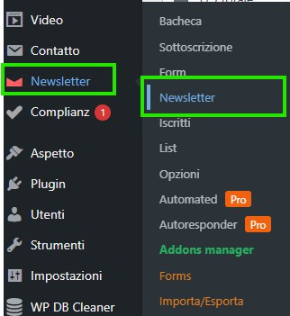
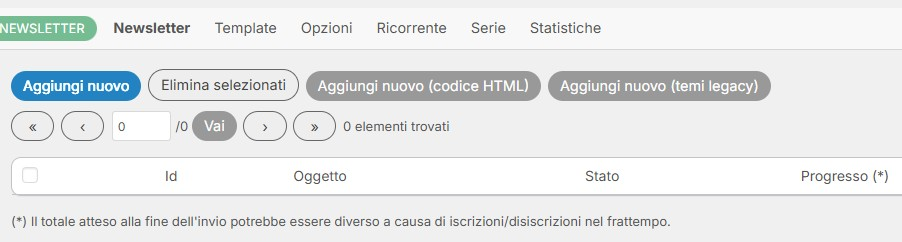
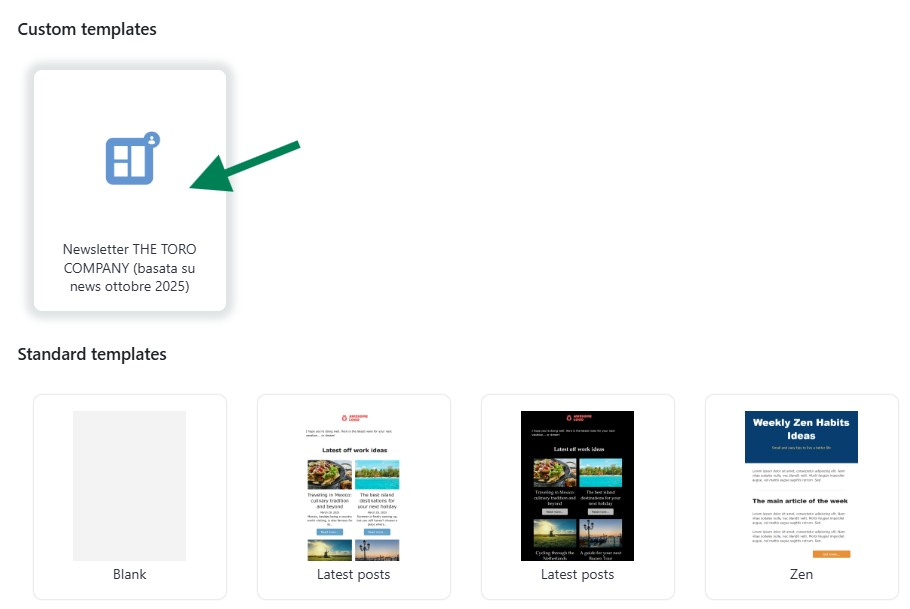
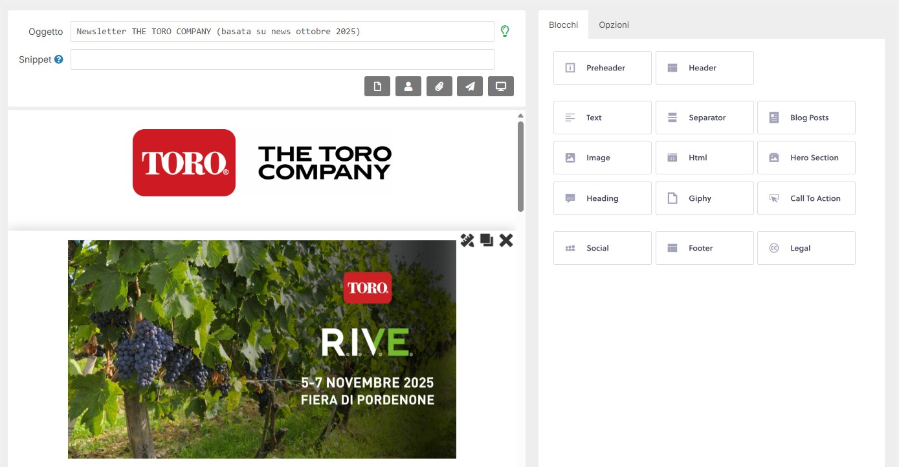
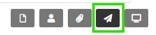
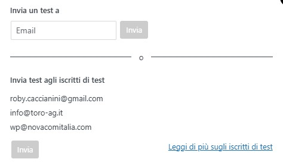
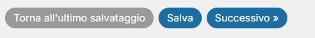
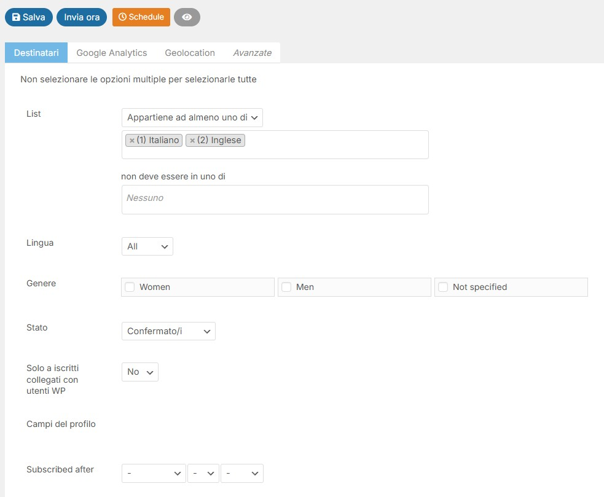
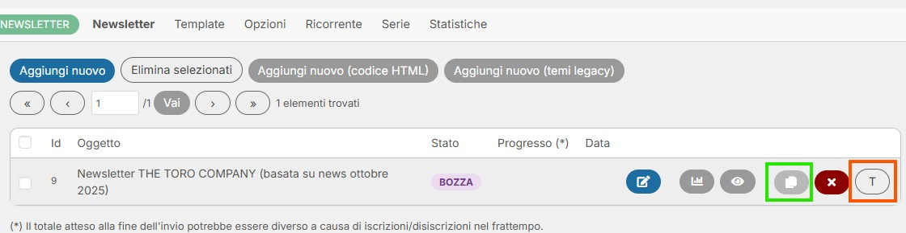

# Newsletter

Guida pratica per creare e inviare newsletter con The Newsletter Plugin.

---

## Accesso alla sezione Newsletter

Per accedere alla gestione delle newsletter:

1. Accedi alla Dashboard WordPress: `https://www.toro-ag.it/wp-admin/`
2. Nel menu laterale sinistro, clicca su **Newsletter**

Dalla sezione Newsletter puoi gestire:
- **Newsletter**: Creare e modificare le newsletter
- **Iscritti**: Gestire gli abbonati
- **List**: Liste di distribuzione
- **Opzioni**: Configurazioni generali

---

## Creare una nuova Newsletter

### 1. Avviare una nuova Newsletter

Nella schermata principale delle Newsletter:

1. Clicca sul pulsante **"Aggiungi nuovo"**
2. Si aprirà la schermata per scegliere il template

### 2. Scegliere il template

Nella schermata di selezione template:

1. Scorri fino ai **Custom templates**
2. Seleziona **"Newsletter THE TORO COMPANY (basata su news ottobre 2025)"** (indicato dalla freccia verde)
3. Questo è il template preparato appositamente per le newsletter aziendali

**Importante**: Usa sempre il template personalizzato per mantenere la coerenza visiva con il brand TORO.

---

## Modificare i contenuti

Una volta selezionato il template, si apre l'editor visuale della newsletter.

L'editor funziona con un sistema **drag & drop** a blocchi che include:
- **Preheader**: Testo di anteprima
- **Header**: Intestazione con logo
- **Text**: Blocchi di testo
- **Image**: Immagini
- **Blog Posts**: Articoli dal sito
- **Hero Section**: Sezioni hero
- **Call To Action**: Pulsanti e CTA
- **Footer**: Piè di pagina

### Guida completa all'editor

Per imparare a usare tutti i blocchi e le funzionalità dell'editor, consulta la **documentazione ufficiale**:

**[The Newsletter Plugin - Composer Guide](https://www.thenewsletterplugin.com/documentation/newsletters/composer/)**

**Suggerimento**: Modifica solo i contenuti delle sezioni principali, mantieni intatti Header e Footer per preservare l'identità del brand.

---

## Testare la Newsletter

Prima di inviare la newsletter a tutti gli iscritti, è fondamentale testarla.

### 1. Accedere al pannello Test

Nella barra superiore dell'editor, clicca sull'icona **"Test"** (quarta icona, con il simbolo di aeroplano)

### 2. Inviare il test

Puoi inviare il test in due modi:

**Opzione A - Email specifica:**
1. Inserisci un indirizzo email nel campo "Email"
2. Clicca su **"Invia"**

**Opzione B - Iscritti di test:**
1. Nella sezione "Invia test agli iscritti di test" trovi gli indirizzi configurati
2. Clicca su **"Invia"** per inviarla a tutti

**Suggerimento**: Controlla sempre la newsletter su diversi client email (Gmail, Outlook, Apple Mail) per verificare la corretta visualizzazione.

---

## Salvare e procedere

Dopo aver completato la modifica e il test:

1. Clicca su **"Salva"** per salvare le modifiche
2. Clicca su **"Successivo →"** per procedere con l'invio

---

## Scegliere i destinatari

Nella schermata di invio puoi configurare i destinatari della newsletter.

### Selezione delle liste

Nella sezione **"List"** seleziona le liste di destinatari:

- **(1) Italiano** - Per inviare agli iscritti italiani
- **(2) Inglese** - Per inviare agli iscritti inglesi

**Per inviare la newsletter a tutti gli iscritti**, seleziona entrambe le liste (Italiano + Inglese).

**Importante**: Controlla sempre di aver selezionato le liste corrette prima dell'invio finale.

### Invio finale

Quando sei pronto:

1. **Salva** - Salva le impostazioni
2. **Invia ora** - Invia immediatamente la newsletter
3. **Schedule** - Programma l'invio per data/ora specifica

---

## Duplicare una Newsletter

Per creare una nuova newsletter partendo da una esistente:

Nella lista delle newsletter:

1. Individua la newsletter che vuoi duplicare
2. Clicca sull'icona **"Duplica"** (icona con due fogli sovrapposti, evidenziata in **verde**)
3. Si creerà una copia che potrai modificare

### Trasformare una Newsletter in Template

Usando l'icona **"T"** (evidenziata in **arancione**) puoi trasformare la newsletter in un template personalizzato che apparirà nella sezione "Custom templates" quando crei una nuova newsletter.

**Suggerimento**: Usa la duplicazione per mantenere la struttura e cambiare solo i contenuti ogni mese.

---

## Riepilogo Workflow

**Flusso completo per creare e inviare una newsletter:**

1. **Newsletter > Aggiungi nuovo**
2. **Seleziona template** "Newsletter THE TORO COMPANY"
3. **Modifica contenuti** nell'editor drag & drop
4. **Salva** le modifiche
5. **Invia test** per controllare
6. **Correggi** eventuali errori
7. **Successivo** per configurare destinatari
8. **Seleziona liste** (Italiano/Inglese o entrambe per tutti)
9. **Invia ora** o **Schedule** per programmarlo

---

## Statistiche e Monitoraggio

Dopo l'invio, nella lista delle newsletter puoi:

- **Visualizzare stato**: Bozza / Inviata
- **Vedere progresso**: Percentuale di invio
- **Accedere alle statistiche**: Click rate, aperture, etc.

---

**Prossimo**: [Domande Frequenti →](07-faq.md)
